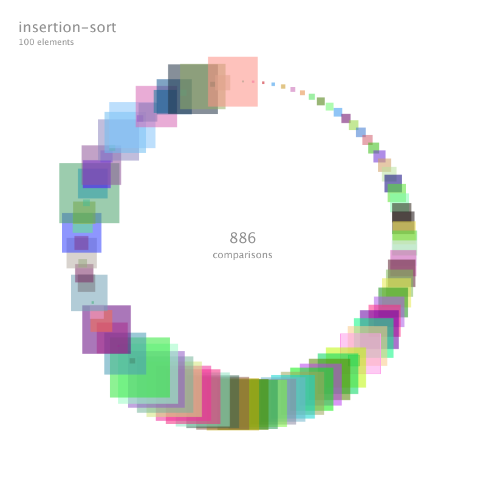
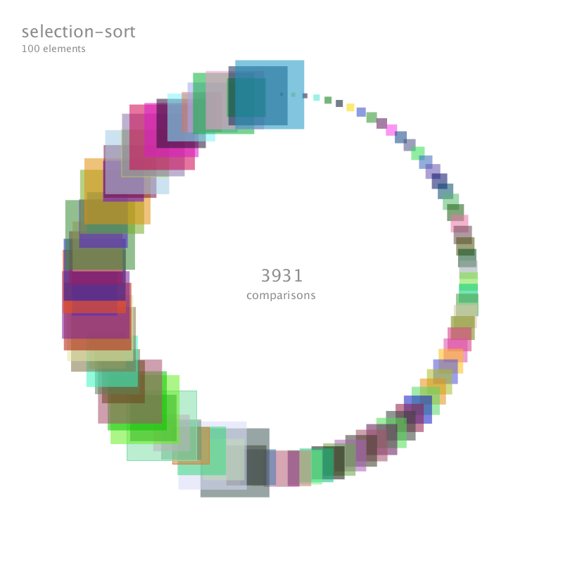
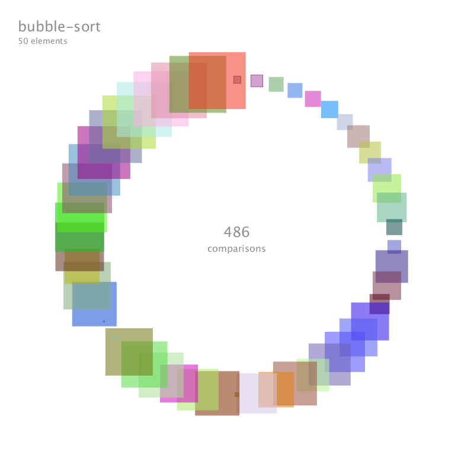

# Sorting Squares

A simple tool for visualizing various sorting algorithms by sorting randomly colored squares into a circle. Various parameters such as the number of elements, square opacity and size range, and the time between animation frames can be changed before running the sketch. 

Currently sorts using insertion sort, bubble sort, and selection sort.

## Getting Started

The following instructions will get you a copy of the project up and running on your local machine.

### Prerequisites

This project uses Processing 3, a Java-based programming language. More information about Processing, as well as instructions on installing Processing, can be found [at their website](https://www.processing.com).

### Installing

Processing requires all source files (*.pde*) to exist inside a *sketch folder* somewhere on your machine. The name of the sketch folder must match the name of the source file. The only file required to run this sketch is *sortingSquares.pde* -- all source code exists in this file. Therefore the folder heirarchy should look like ...*/sortingSquares/sortingSquares.pde*. After installing Processing, open the sketch folder within Processing and run the sketch.

## Examples

  
  
  

## Authors

* **kcbw**

## Acknowledgement

* **daggad95** - Inspiration
* **Renoh47** - Added configurable data sets, color options
